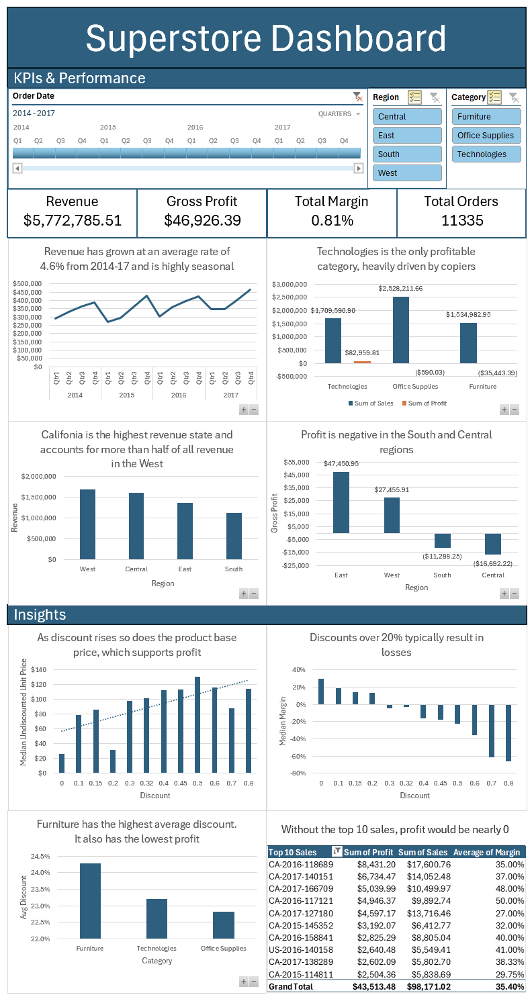

**Superstore Dataset Cleaning & Analysis**
==========================================

**Project Overview**
--------------------

This project demonstrates end-to-end analysis of a retail sales dataset using Excel, including:

*   Data cleaning and validation
    
*   Feature engineering with calculated columns
    
*   Exploratory data analysis (EDA)
    
*   Profitability and discount analysis
    
*   Scenario modeling
    
*   Dashboard development
    

The goal of the project is to simulate a real-world business scenario and answer:

**What drives sales and profitability, and how can pricing and discount strategies be improved?**

**Dataset**
-----------

[Superstore Sales Dataset](https://www.kaggle.com/datasets/dataobsession/superstore-sales-the-data-quality-challenge)

The dataset contains transactional sales data, including:

*   Orders, products, and categories
    
*   Sales, profit, discount, and quantity
    
*   Geographic and temporal dimensions
    

The raw data required extensive cleaning due to inconsistencies, missing values, and economically implausible records.

**Data Cleaning**
-----------------

A structured cleaning process was applied to ensure data quality while preserving analytical flexibility.

### **Approach**

*   Structural corrections (formatting, duplicates, text standardization)
    
*   Feature engineering through calculated columns
    
*   Handling missing and inconsistent values
    
*   Business rule validation
    
*   Outlier detection and classification
    
*   Flagging ambiguous records instead of removing them
    

**Key Principle:** Records that violated clear business constraints were removed. Records with uncertain validity were retained but flagged.

### **Key Cleaning Decisions**

*   Reformatted postal codes and standardized categorical fields
    
*   Removed duplicate records using a composite key (Order ID + Product ID)
    
*   Created calculated fields (Margin, Unit Price, Undiscounted Unit Price)
    
*   Reconstructed missing values (e.g., Region) where logically derivable
    
*   Applied business rules to remove invalid records (e.g., extreme margins, unrealistic sales values)
    
*   Flagged incomplete or ambiguous records (e.g., missing profit, uncertain discounts)
    
*   Identified and flagged product-level pricing inconsistencies rather than removing them
    

The result is a dataset that is both **clean and analytically transparent**, with validation flags controlling inclusion in calculations. Refer to the Data Cleaning Log for extensive details of the cleaning process.

**Exploratory Data Analysis**
-----------------------------

### **Sales Performance**

*   Office Supplies generates the highest total revenue
    
*   The West region leads sales, driven largely by California
    
*   Sales exhibit strong seasonality:
    
    *   Q1 consistently lowest
        
    *   Q4 consistently highest
        
*   Sales are growing at an average rate of **~4.6% annually**
    

### **Profitability Analysis**

Despite strong sales, profitability is weak:

*   Overall margin: **~0.8%**
    
*   Profit is highly concentrated:
    
    *   Most profit generated in 2017
        
    *   Earlier years near break-even or negative
        
*   Removing the top 10 most profitable transactions reduces total profit to approximately zero
    

**By segment:**

*   Profitable regions: West, East
    
*   Unprofitable regions: Central, South
    
*   Only profitable category: Technologies
    
*   Furniture is significantly unprofitable
    

**Note:** Missing profit values slightly understate total profit, but the impact is estimated to be less than 10% (~$4,500) over the entire period.

**Discount Analysis (Key Insight)**
-----------------------------------

### **1\. Evidence of Price Inflation Before Discounts**

A strong positive correlation (**0.92**) exists between Discount and Undiscounted Unit Price.

This suggests that:

Products may be priced higher before applying discounts, reducing the true impact of the discount.

An alternative hypothesis—that higher-priced items simply receive larger discounts—was tested and rejected due to a weak correlation (**0.11**) between product price and discount.

**Conclusion:**Discounting behavior appears to be influenced by pricing strategy rather than purely by product value.

### **2\. Discounts and Profitability**

*   Discounts above **20%** are consistently unprofitable
    
*   Most total profit comes from:
    
    *   0% discount sales (35% of all sales volume)
        
    *   20% discount sales (23% of all sales volume)
        

However:

*   **10–15% discounts produce the highest profit per sale**, exceeding even full-price sales
    
*   These discounts are used far less frequently, making conclusions about scalability uncertain
    

**Key Insight:**Moderate discounts may offer the best balance between volume and profitability.

**Scenario Modeling: Discount Optimization**
--------------------------------------------

To evaluate potential improvements, a revised discount structure was tested.

### **Approach**

*   Reduced extreme discount levels (e.g., 65% → 60%, 80% → 75%)
    
*   Simplified discount tiers (e.g. 32% → 30%)
    
*   Focused on minimizing high-loss transactions
    

### **Results**

*   **+351% increase in total profit**
    
*   **~2.9% increase in revenue**
    

### **Interpretation**

*   Profit gains are driven primarily by reducing extreme losses from discounts over 50%
    
*   Minimal revenue impact suggests limited risk to demand
    
*   Adjusting discount levels is significantly more impactful than changing discount frequency which was also tested
    

**Key Takeaways**
-----------------

*   Revenue is strong and growing, but profitability is critically low
    
*   Discount strategy is the primary driver of losses
    
*   Evidence suggests price inflation prior to discounting
    
*   Moderate discounts (10–15%) may be underutilized and highly effective
    
*   Reducing extreme discounts can dramatically improve profitability with minimal impact on revenue
    

**Dashboard**
-------------

An interactive Excel dashboard was created to visualize:

*   Sales and profit performance
    
*   Category and regional breakdowns
    
*   Discount vs profitability relationships
    
*   Key KPIs and trends
    

**Skills Demonstrated**
-----------------------

*   Data cleaning and validation
    
*   Feature engineering
    
*   Exploratory data analysis
    
*   Statistical reasoning and hypothesis testing
    
*   Scenario modeling
    
*   Business insight generation
    
*   Data visualization in Excel
    

**Conclusion**
--------------

This project demonstrates the ability to work with messy, real-world data and translate it into actionable business insights.

The analysis highlights how seemingly small pricing decisions—particularly around discounting—could have a significant impact on overall profitability for this company.